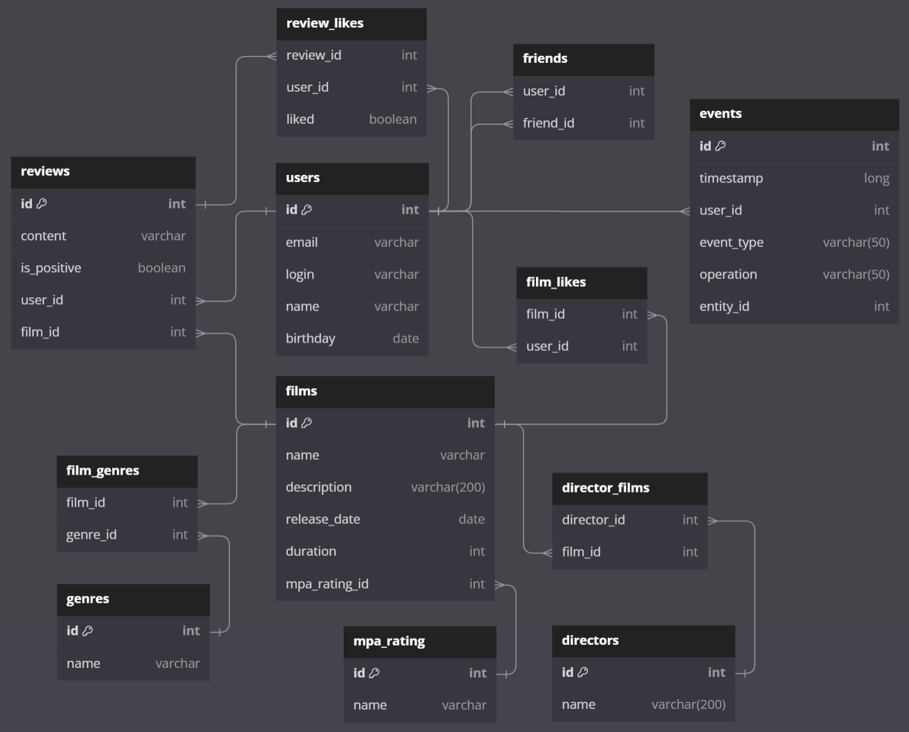

# Filmorate
Filmorate - это сервис, работающий с фильмами и оценками пользователей. С Filmorate ни вам, ни вашим друзьям не придётся долго размышлять, что посмотреть вечером. В этом репозитории представлена backend-часть сервиса.

## Схема базы данных сервиса



## Примеры запросов к базе данных

<details>
  <summary><h3>Пользователи</h3></summary>

* получение списка пользователей
```SQL
SELECT *
FROM users
ORDER BY id
```
* получение информации о пользователе по его `id`
```SQL
SELECT *
FROM users
WHERE id = ?
```
* получение списка друзей пользователя по его `id`
```SQL
SELECT users.*
FROM users
JOIN friends ON users.id = friends.friend_id
WHERE friends.user_id = ?
```

</details>

<details>
  <summary><h3>Фильмы</h3></summary>

* получение списка фильмов
```SQL
SELECT films.*,
       COUNT(film_likes.user_id) AS likes
FROM films
LEFT JOIN film_likes ON films.id = film_likes.film_id
GROUP BY films.id
ORDER BY films.id
```
* получение информации о фильме по его `id`
```SQL
SELECT films.*,
       COUNT(film_likes.user_id) AS likes
FROM films
LEFT JOIN film_likes ON films.id = film_likes.film_id
WHERE films.id = ?
GROUP BY films.film_id
```
* получение списка из первых `count` фильмов по количеству лайков
```SQL
SELECT films.*,
       COUNT(film_likes.user_id) AS likes
FROM films
LEFT JOIN film_likes ON films.id = film_likes.film_id
GROUP BY films.id
ORDER BY rate DESC, films.id
LIMIT ?
```

</details>

<details>
  <summary><h3>Жанры</h3></summary>

* получение списка жанров
```SQL
SELECT *
FROM genres
ORDER BY genre_id
```
* получение информации о жанре по его `id`
```SQL
SELECT *
FROM genres
WHERE id = ?
```

</details>